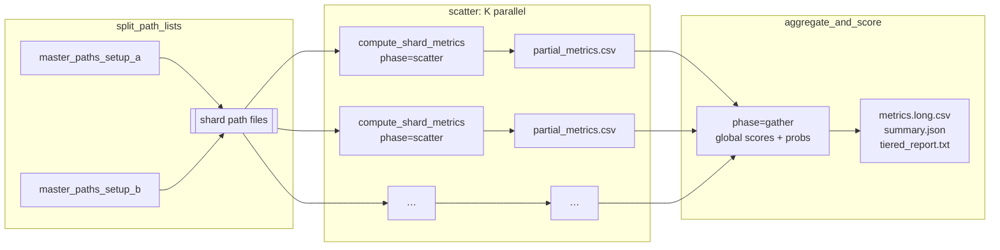

# GWAS calibration QC — Cromwell workflow

A reproducible **[WDL](https://openwdl.org/)** workflow for large-scale **statistical calibration quality control** of genome-wide association study (GWAS) or protein quantitative trait locus (pQTL) **summary statistics** on **Google Cloud Platform**. The workflow localises per-trait sumstats from object storage, runs a containerised calibration analysis in parallel where configured, and packages metrics, reports, and optional diagnostic figures for downstream triage or method comparison.

**Licence:** The **WDL**, **Dockerfile**, **helper scripts**, and **documentation** in this repository are released under the **[MIT Licence](LICENSE)**. The bundled **gwas-calibration-utils** dependency remains under its own **MIT** terms (see that package’s metadata).

This repository provides **orchestration only** (WDL, Docker build metadata, and operational examples). The numerical methods are implemented in the **gwas-calibration-utils** Python package, which is installed inside the workflow container image.

---

## Purpose and scope

**Calibration** here means checking whether *p*-values on variants that are **not** expected to carry a true genetic signal behave like **null *p*-values** — i.e. approximately **uniform on (0, 1)** after appropriate masking. Strong cis associations and lead signals violate that null on nearby variants; the analysis therefore **masks** (excludes) configurable **cis regions** (from optional JSON) and a **symmetric window around each lead variant** (workflow default **±1.5 Mb** on the lead chromosome, **3 Mb** total — input **`lead_window_bp`**) before evaluating the *trans* remainder.

Typical uses:

- **Batch QC** across hundreds or thousands of traits after a production GWAS or pQTL pipeline.
- **Comparing two processing setups** (e.g. normalisation or batch-correction choices) on the same traits using paired path lists and shared masking configuration.

The workflow does **not** replace association testing, fine-mapping, or colocalisation; it **summarises distributional behaviour** of *p*-values on the masked SNP set and emits ranked **composite calibration scores** for relative ranking within a run.

### Lead-variant cis-like window (geometry)

The workflow parameter **`lead_window_bp`** is a **half-width in base pairs** on the **lead chromosome only** (the chromosome where the trait’s lead variant lies). Masking is applied **symmetrically** around the lead’s genomic position:

- **Excluded interval (inclusive bounds):**  
  \[ **lead_pos − lead_window_bp**, **lead_pos + lead_window_bp** \]  
  on that chromosome.
- **Default:** `lead_window_bp = 1 500 000` → **±1.5 Mb** around the lead → **3 Mb** contiguous span.
- **Worked example:** Suppose the lead variant is **chr1:50 000 000** (GRCh38-style coordinates) and `lead_window_bp = 1 500 000`. Then every variant on **chr1** with position in **48 500 000–51 500 000** is **excluded** from the *trans* calibration set. Variants on other chromosomes are **not** affected by this rule (cis JSON handles separate locus exclusions).
- **`lead_window_bp = 0`:** Lead coordinates may still be loaded or auto-generated, but **no** lead-adjacent SNPs are removed; only cis JSON (if any) applies.

---

## Scientific rationale

Under the **global null** for a given SNP (no association), the two-sided test *p*-value is (asymptotically) **Uniform(0, 1)**. Transforming *p* to a one-degree-of-freedom chi-square statistic,

$$
X = F_{\chi^2(1)}^{-1}(1 - p),
$$

gives **$X \sim \chi^2(1)$** under that null. **Genomic control** and **quantile inflation** summarise whether realised *X* (or equivalently *p*) is **stochastically larger** than the null (inflation) or **smaller** (deflation).

After **removing cis and lead-adjacent variants**, the remaining SNPs are treated as **null-enriched** for the purpose of calibration diagnostics: under a well-calibrated pipeline, their *p*-values should not show **systematic** bulk or **tail** inflation relative to Uniform(0, 1). Deviations often indicate **misspecification**, **residual confounding**, **batch artefacts**, **allele-frequency quirks**, or **overfitting** in secondary processing — hence the value of a standardised QC pass before release or cross-cohort meta-analysis.

---

## Mathematical foundation (summary)

All metrics below are computed on the **masked** SNP table for each trait (same chromosome/position conventions as the input files).


| Family                  | Construction                                                                                                                                                                   | Null reference                                                  |
| ----------------------- | ------------------------------------------------------------------------------------------------------------------------------------------------------------------------------ | --------------------------------------------------------------- |
| **Genomic control λGC** | Let $X_i$ be $\chi^2(1)$ transforms of *p*-values. $\lambda_{\mathrm{GC}} = \mathrm{median}_i(X_i) / \mathrm{median}(\chi^2(1))$. The median of $\chi^2(1)$ is ≈ **0.4549**.   | $\lambda_{\mathrm{GC}} \approx 1$                               |
| **Quantile λ**          | For quantile *q*, ratio of the empirical quantile of $X_i$ to the theoretical $\chi^2(1)$ quantile at *q* (e.g. *q* ∈ {0.5, 0.9, 0.99, 0.999}).                                | ≈ 1 at each *q*                                                 |
| **Tail excess (K/E)**   | At threshold α, **K** = count of SNPs with *p* ≤ α; **E** = *m*α for *m* SNPs. Report **K/E** for several α (e.g. 10⁻⁴ … 10⁻⁷).                                                | **K/E** ≈ 1                                                     |
| **Goodness-of-fit**     | Histogram test of *p* against Uniform(0, 1) on a fixed bin grid (including a fine bin near 0). Yields a $\chi^2$ statistic and *p*-value for global departure from uniformity. | Non-small GOF *p*                                               |
| **Rare vs common**      | Same K/E-style tail ratio restricted to **rare** vs **common** SNPs (using allele-frequency column).                                                                           | Similar ratios; large gaps suggest frequency-specific artefacts |


**Composite calibration score** (per trait, **lower is better**): a **weighted sum of penalties** measuring distance from the null for tail quantile λ, median λ, tail excess, rare–common discrepancy, and a **capped, down-weighted** GOF term so that tail behaviour drives the score. The GOF contribution is **min–max normalised across all traits in the batch** before entering the score, so it is **not** a purely per-trait quantity. **Robust *z*-scores** of that composite are formed **within each workflow run** (median and MAD across **all** traits’ scores), then mapped to a **run-relative** “quality probability” via a logistic transform; this is a **ranking aid within the batch**, not a calibrated Bayesian posterior.

Because both the **GOF normalisation** and the **median/MAD standardisation** require the **entire batch**, a naïve Cromwell scatter that computes “quality probability” **inside each shard** would be statistically wrong. The **scatter–gather** workflow (below) defers those steps to a **single gather** task after all shards finish.

Full formula detail is documented alongside the **gwas-calibration-utils** package (see **Attribution**).

---

## End-to-end flow

The diagram links **Cromwell orchestration**, **data localisation**, **masking**, **metric and score computation**, and **artefacts**. Solid steps run on the worker VM inside the container; dashed notes are conceptual (null expectations).


**Lead variants:** If the workflow input **`lead_variants_json`** is **omitted**, the task passes an output path under **`results/`** that **does not exist yet**. The engine **creates** it by scanning the localised sumstats and taking the **genome-wide minimum *p*-value** row per trait, then applies the lead-window mask (**default `lead_window_bp` = 1 500 000** → **±1.5 Mb** on the lead chromosome, **3 Mb** total cis-like span). Override via **`gwas_calibration_qc.lead_window_bp`** in inputs JSON. Supply **`lead_variants_json`** only when you require a **fixed**, pre-computed lead file from object storage.

**Cis regions:** Optional JSON defines per-trait intervals and/or explicit positions to exclude before metrics.

---

## Repository layout

```
GWAS_calibration_engine/
├── LICENSE
├── docker/
│   └── Dockerfile
├── scripts/
│   ├── generate_path_lists.py
│   └── harvest_calibration_outputs.py
├── wdl/
│   ├── gwas_calibration_qc.wdl
│   ├── gwas_calibration_qc.example.json
│   ├── gwas_calibration_qc_scattered.wdl
│   └── gwas_calibration_qc_scattered.example.json
├── requirements.txt
└── README.md
```

Chunk-specific path lists and Cromwell inputs that point at internal buckets are **not** tracked in this repository (see **`.gitignore`**). Build path lists with **`scripts/generate_path_lists.py`** and start from **`wdl/gwas_calibration_qc.example.json`** or **`wdl/gwas_calibration_qc_scattered.example.json`**.

---

## Parallelism, scattering, and jobs per task

Two orchestration modes exist:

| Mode | WDL | Cromwell jobs (typical) | When to use |
|------|-----|---------------------------|-------------|
| **Single task** | [`wdl/gwas_calibration_qc.wdl`](wdl/gwas_calibration_qc.wdl) | **1** heavy VM per workflow run | Smaller batches, simpler ops |
| **Scatter–gather** | [`wdl/gwas_calibration_qc_scattered.wdl`](wdl/gwas_calibration_qc_scattered.wdl) | **1** split + **K** shard VMs + **1** gather | Large batches (e.g. thousands of traits), smaller disk per VM, higher wall-clock parallelism |

### Single-task workflow (`gwas_calibration_qc.wdl`)

This variant **does not** use Cromwell **`scatter`** over traits. Each successful submission runs **one** backend job: **`run_calibration_one_setup`** or **`run_calibration_two_setups`**. Every line in **`paths_setup_a`** (and **`paths_setup_b`** when comparing) is localised to **that same worker**; all traits share one machine’s CPU, RAM, and disk.

**`n_jobs` (intra-task parallelism):** Passed to the calibration engine and set as **`runtime.cpu`**. The engine uses a **process pool** of at most **`n_jobs`** concurrent trait workers. This does **not** multiply Cromwell jobs.

**Disk:** **`ceil`** of total localised input size (both setups when comparing) plus **20 GiB** padding.

### Scatter–gather workflow (`gwas_calibration_qc_scattered.wdl`)

Use this when you want **many Cromwell shards**, each processing a **subset** of the master path list(s), while still computing **batch-global** composite scores and quality probabilities **once** at the end.

**`n_shards` (Cromwell-level parallelism):** The **`split_path_lists`** task splits **`master_paths_setup_a`** (and **`master_paths_setup_b`** when **`two_setups`**) into **`min(n_shards, N)`** shards, where **N** is the number of lines. Each shard is one **`compute_shard_metrics`** call running **`gwas-calibration-qc --phase scatter`**, which writes **`calibration_compare.partial_metrics.csv`** (raw per-trait metrics **only**).

**`n_jobs` (still intra-task):** Within each shard VM, **`n_jobs`** controls the Python process pool size for traits **in that shard** (same semantics as the single-task workflow).

**Gather:** After all shards succeed, **`aggregate_and_score`** runs **`--phase gather`**, merges every partial CSV, runs global **`calibration_score`**, **median/MAD** standardisation, and **`quality_prob_good`**, then emits the same final **`calibration_compare.metrics.long.csv`**, **`summary.json`**, and **`tiered_report.txt`** as a full single-batch run.

**Pairing (two setups):** Master lists must be **line-aligned**; the splitter preserves row pairing within each shard.

**Disk per shard:** Scales with **shard size** (~1/K of total sumstats) plus padding — typically far smaller than one VM holding all traits.



### CLI phases (container / local)

The Python engine supports **`--phase full`** (default), **`--phase scatter`**, and **`--phase gather`**. The **same** container image is used for scatter and gather; **rebuild** only when the **gwas-calibration-utils** code changes.

| Phase | Role |
|-------|------|
| **`full`** | End-to-end single batch (current default behaviour). |
| **`scatter`** | Per-shard raw metrics → **`calibration_compare.partial_metrics.csv`**; no summary/tiered report. |
| **`gather`** | **`--partial-csv-list`** (and/or repeated **`--partial-csv`**) → final long CSV, summary, tiered report, pivot (when comparing). |

---

## Scatter–gather workflow inputs (summary)

| Input | Type | Description |
|-------|------|-------------|
| `master_paths_setup_a` | `File` | Master text file: one `gs://` URI per line. |
| `master_paths_setup_b` | `File?` | Second master list; required when `two_setups` is `true` (same line count as A). |
| `two_setups` | `Boolean` | Paired two-setup comparison vs single batch. |
| `n_shards` | `Int` | Requested shard count; effective shards = **`min(n_shards, N traits)`**. |
| `n_jobs`, `memory_gb`, `lead_window_bp`, `cis_json`, `lead_variants_json`, `diagnostic_plots`, … | — | Same meaning as in the single-task workflow (see table below). |
| `split_cpu`, `split_memory_mb` | `Int` | Resources for **`split_path_lists`**. |
| `gather_cpu`, `gather_memory_gb` | `Int` | Resources for **`aggregate_and_score`** (CSV-only; small). |
| `docker` | `String` | Container image URI (same as single-task workflow). |

---

## Workflow inputs (summary) — single-task `gwas_calibration_qc.wdl`


| Input                            | Type            | Description                                                                                               |
| -------------------------------- | --------------- | --------------------------------------------------------------------------------------------------------- |
| `paths_setup_a`                  | `File`          | Text file: one `gs://` URI per line (sumstats per trait).                                                 |
| `two_setups`                     | `Boolean`       | `true` = compare two setups; `false` = single batch.                                                      |
| `paths_setup_b`                  | `File?`         | Second path list; required when `two_setups` is `true`.                                                   |
| `lead_variants_json`             | `File?`         | Optional fixed lead file. Omit to auto-generate under `results/` on the worker.                           |
| `cis_json`                       | `File?`         | Optional cis masking specification.                                                                       |
| `setup_label_a`, `setup_label_b` | `String`        | Human-readable setup names (second label unused when `two_setups` is `false`).                            |
| `protein_id_mode`                | `String`        | How trait IDs are derived from filenames (`first_segment` or `stem`).                                     |
| `n_jobs`, `memory_gb`            | `Int`           | Parallel worker count and worker RAM (gigabytes; formatted as `"{memory_gb} GB"` in the backend runtime). |
| `diagnostic_plots`               | `Boolean`       | Emit per-trait diagnostic figures when dependencies are present in the image.                             |
| `top_n_trans`, `probability_rho` | `Int` / `Float` | Analysis tuning (tail reporting depth; sigmoid sharpness for run-relative quality).                       |
| `lead_window_bp`                 | `Int`           | Half-width in bp around each lead on the lead chromosome (default **1500000** → ±1.5 Mb, **3 Mb** total span). **0** disables lead masking while still loading leads. |
| `docker`                         | `String`        | Full container image URI (including tag).                                                                 |

---

## Workflow outputs

Cromwell materialises **declared output files** (and may copy them to a bucket if **`final_workflow_outputs_dir`** is set in workflow options). Typical artefacts:

### Single-task workflow (`gwas_calibration_qc.wdl`)

| Artefact                                | Role                                                            |
| --------------------------------------- | --------------------------------------------------------------- |
| `calibration_outputs.tgz`               | Archive of the entire `results/` tree.                          |
| `calibration_compare.metrics.long.csv`  | Long-format metrics per trait (and setup, if comparing).        |
| `calibration_compare.summary.json`      | Run-level summary.                                              |
| `calibration_compare.tiered_report.txt` | Human-readable tiered KPI report.                               |
| `gwas_calibration_qc.log`               | Execution log.                                                  |
| `results/lead_variants.json`            | Present when leads were auto-generated or written to that path. |

### Scatter–gather workflow (`gwas_calibration_qc_scattered.wdl`)

| Artefact | Role |
|----------|------|
| **`metrics_long_csv`**, **`summary_json`**, **`tiered_report_txt`**, **`pivot_csv`** | Same semantics as the single-task workflow (final batch-global scores). |
| **`shard_partial_metrics_csv`** | `Array[File]`: one **`calibration_compare.partial_metrics.csv`** per shard. |
| **`shard_logs`**, **`shard_plots_tgz`**, **`shard_lead_variants_json`** | Per-shard logs, **`results/`** tarballs, and optional **`lead_variants.json`** copies. |
| **`gather_log`** | Log from the **`aggregate_and_score`** task. |

With **`diagnostic_plots: true`**, each shard’s **`shard_plots_tgz`** contains that shard’s figures (QQ, tail-excess, etc.); there is **no** single combined tarball unless you merge outputs downstream.

---

## Building the container image

The **Dockerfile** expects a **build context** that contains **both**:

- this **`GWAS_calibration_engine`** tree (for workflow-specific requirements), and
- the **gwas-calibration-utils** source tree (sibling path **`Python_scripts/gwas_calibration_utils`** in the upstream layout).

### Option A — Local Docker

From that shared parent directory (call it **`REPO_ROOT`**):

```bash
cd REPO_ROOT

docker build \
  --progress=plain \
  -f Github_clones/GWAS_calibration_engine/docker/Dockerfile \
  -t LOCATION-docker.pkg.dev/PROJECT/REGISTRY/gwas-calibration-qc:TAG \
  .
```

Then push:

```bash
gcloud auth configure-docker LOCATION-docker.pkg.dev
docker push LOCATION-docker.pkg.dev/PROJECT/REGISTRY/gwas-calibration-qc:TAG
```

### Option B — Cloud Build (no local Docker)

When Docker is **not installed** on your machine (common on shared compute VMs), use **Google Cloud Build** to build and push the image remotely. The challenge is that the **`REPO_ROOT`** may be very large (hundreds of GiB of sumstats, analysis outputs, etc.), and `gcloud builds submit` tars the **entire** source directory before uploading — making it impractical to point at the monorepo root.

**Solution — lightweight staging context:** Create a small temporary directory that mirrors **only** the two `COPY` source paths the Dockerfile needs, add a `cloudbuild.yaml`, and submit that. Total upload is typically under **1 MiB**.

```bash
STAGE=$(mktemp -d)

# Mirror only the paths referenced in the Dockerfile
mkdir -p "$STAGE/Github_clones/GWAS_calibration_engine/docker" \
         "$STAGE/Python_scripts"

cp REPO_ROOT/Github_clones/GWAS_calibration_engine/docker/Dockerfile \
   "$STAGE/Github_clones/GWAS_calibration_engine/docker/"
cp REPO_ROOT/Github_clones/GWAS_calibration_engine/requirements.txt \
   "$STAGE/Github_clones/GWAS_calibration_engine/"
cp -r REPO_ROOT/Python_scripts/gwas_calibration_utils \
   "$STAGE/Python_scripts/"

# Write a minimal Cloud Build config
cat > "$STAGE/cloudbuild.yaml" <<'YAML'
steps:
  - name: 'gcr.io/cloud-builders/docker'
    args:
      - 'build'
      - '-f'
      - 'Github_clones/GWAS_calibration_engine/docker/Dockerfile'
      - '-t'
      - 'LOCATION-docker.pkg.dev/PROJECT/REGISTRY/gwas-calibration-qc:TAG'
      - '.'
images:
  - 'LOCATION-docker.pkg.dev/PROJECT/REGISTRY/gwas-calibration-qc:TAG'
YAML

# Submit — use a region-located staging bucket if your org policy restricts resources
gcloud builds submit "$STAGE" \
  --config "$STAGE/cloudbuild.yaml" \
  --project PROJECT \
  --region LOCATION \
  --gcs-source-staging-dir gs://YOUR_BUCKET/tmp/cloud_build_staging \
  --timeout=1200

# Clean up
rm -rf "$STAGE"
```

Replace **`LOCATION`**, **`PROJECT`**, **`REGISTRY`**, **`TAG`**, and **`YOUR_BUCKET`** with your values. The staging tarball is automatically removed from Cloud Build's source bucket after the build; you may also delete the `gs://` staging prefix manually.

**Why this works:** The Dockerfile's two `COPY` instructions reference **relative** paths (`Github_clones/GWAS_calibration_engine/requirements.txt` and `Python_scripts/gwas_calibration_utils`). By reconstructing **only** those subtrees in a temporary directory, we replicate the layout the Dockerfile expects without touching the hundreds of gigabytes of unrelated data in the monorepo.

### Troubleshooting

| Symptom | Likely cause |
|---------|-------------|
| `COPY` fails for `Python_scripts/…` | Build context does not mirror the Dockerfile's expected tree layout. |
| `HTTPError 412: 'us' violates constraint` | Org policy restricts resource locations. Pass **`--region`** and **`--gcs-source-staging-dir`** pointing to a bucket in the allowed region. |
| Image pull fails on Cromwell | Worker service account lacks Artifact Registry read permission, or URI/tag mismatch. |

### Smoke test

After build, the image exposes the **`gwas-calibration-qc`** console entry point:

```bash
docker run --rm LOCATION-docker.pkg.dev/PROJECT/REGISTRY/gwas-calibration-qc:TAG \
  gwas-calibration-qc --help
```

Exit code **0** confirms the environment is wired correctly. If Docker is not available locally, verify via Cloud Build logs or by pulling the image on a different machine.

Use the **same** URI (including tag) as **`gwas_calibration_qc.docker`** in your Cromwell inputs.

---

## Cromwell requirements

The workflow uses **conditional calls** (`if` on `two_setups`) and **`select_first`** over task outputs. Use a **recent Cromwell** (e.g. 50+ or your platform’s supported release) so optional outputs from branches resolve correctly.

Default runtime hints target **preemptible** VMs in **europe-west1** with **no public egress** from the worker (`noAddress: true`), matching common secure batch-QC deployments; adjust zones and flags to match your organisation’s policy.

### Optional `File?` inputs and path localisation

**`cis_json`** and optional **`lead_variants_json`** are **`File?`** workflow inputs. The WDL builds `--cis-json …` and `--lead-variants-json …` flags using **`~{…}`** interpolation **inside** the task `command` block, so Cromwell substitutes **localised disk paths** after download. Do **not** pre-compose those paths as `String` values in the task declaration section by concatenating a `File?` into a string: that can freeze the original **`gs://`** URI in the rendered script and cause the worker to fail when the engine expects a readable local file.

### `lead_window_bp` and the container image

The workflow passes **`--lead-window-bp ~{lead_window_bp}`** explicitly (default **1500000**). That keeps masking behaviour aligned with this repository even if an older image still carried a different Python default. To change the window, set **`gwas_calibration_qc.lead_window_bp`** in Cromwell inputs (use **0** to load leads but disable lead-window masking). Rebuild and push the image when you need an updated **gwas-calibration-utils** implementation inside the container.

### Workflow options and Google labels

Some Cromwell clients require **`google_labels`** (including **`product`**) in the **workflow options** JSON. If your tool treats **`--options`** and **`--l`** as mutually exclusive, add a **`google_labels`** object to the same JSON you pass as **`--options`** (see your platform’s submission examples).

---

## Attribution

- **Numerical methodology and metric definitions:** **gwas-calibration-utils** (Python; MIT-licensed in its source metadata).
- **Path-list and object-storage patterns** follow common practice for large-scale GWAS execution on GCS-backed Cromwell.

---

## Licence

- **This repository** (WDL, Docker build files, scripts under `scripts/`, and this README): **[MIT Licence](LICENSE)** — see **`LICENSE`** for the full text.
- **gwas-calibration-utils** (vendored or installed from source into the image): **MIT** under that package’s own copyright and licence notice; retain those notices when redistributing source or images that bundle the package.