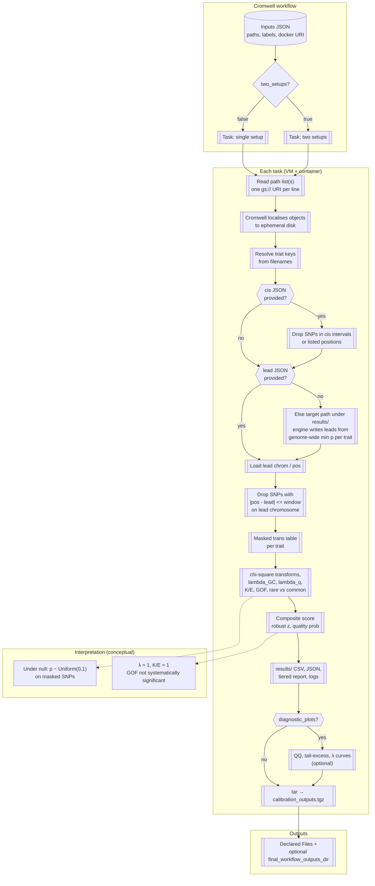

# GWAS calibration QC — Cromwell workflow

A reproducible **[WDL](https://openwdl.org/)** workflow for large-scale **statistical calibration quality control** of genome-wide association study (GWAS) or protein quantitative trait locus (pQTL) **summary statistics** on **Google Cloud Platform**. The workflow localises per-trait sumstats from object storage, runs a containerised calibration analysis in parallel where configured, and packages metrics, reports, and optional diagnostic figures for downstream triage or method comparison.

This repository provides **orchestration only** (WDL, Docker build metadata, and operational examples). The numerical methods are implemented in the **gwas-calibration-utils** Python package, which is installed inside the workflow container image.

---

## Purpose and scope

**Calibration** here means checking whether *p*-values on variants that are **not** expected to carry a true genetic signal behave like **null *p*-values** — i.e. approximately **uniform on (0, 1)** after appropriate masking. Strong cis associations and lead signals violate that null on nearby variants; the analysis therefore **masks** (excludes) configurable **cis regions** and a **symmetric window around each lead variant** before evaluating the *trans* remainder.

Typical uses:

- **Batch QC** across hundreds or thousands of traits after a production GWAS or pQTL pipeline.
- **Comparing two processing setups** (e.g. normalisation or batch-correction choices) on the same traits using paired path lists and shared masking configuration.

The workflow does **not** replace association testing, fine-mapping, or colocalisation; it **summarises distributional behaviour** of *p*-values on the masked SNP set and emits ranked **composite calibration scores** for relative ranking within a run.

---

## Scientific rationale

Under the **global null** for a given SNP (no association), the two-sided test *p*-value is (asymptotically) **Uniform(0, 1)**. Transforming *p* to a one-degree-of-freedom chi-square statistic,

$$
X = F_{\chi^2(1)}^{-1}(1 - p),
$$

gives **$X \sim \chi^2(1)$** under that null. **Genomic control** and **quantile inflation** summarise whether realised *X* (or equivalently *p*) is **stochastically larger** than the null (inflation) or **smaller** (deflation).

After **removing cis and lead-adjacent variants**, the remaining SNPs are treated as **null-enriched** for the purpose of calibration diagnostics: under a well-calibrated pipeline, their *p*-values should not show **systematic** bulk or **tail** inflation relative to Uniform(0, 1). Deviations often indicate **misspecification**, **residual confounding**, **batch artefacts**, **allele-frequency quirks**, or **overfitting** in secondary processing — hence the value of a standardised QC pass before release or cross-cohort meta-analysis.

---

## Mathematical foundation (summary)

All metrics below are computed on the **masked** SNP table for each trait (same chromosome/position conventions as the input files).

| Family | Construction | Null reference |
|--------|----------------|-----------------|
| **Genomic control λ<sub>GC</sub>** | Let $X_i$ be $\chi^2(1)$ transforms of *p*-values. $\lambda_{\mathrm{GC}} = \mathrm{median}_i(X_i) / \mathrm{median}(\chi^2(1))$. The median of $\chi^2(1)$ is ≈ **0.4549**. | $\lambda_{\mathrm{GC}} \approx 1$ |
| **Quantile λ** | For quantile *q*, ratio of the empirical quantile of $\{X_i\}$ to the theoretical $\chi^2(1)$ quantile at *q* (e.g. *q* ∈ {0.5, 0.9, 0.99, 0.999}). | ≈ 1 at each *q* |
| **Tail excess (K/E)** | At threshold α, **K** = count of SNPs with *p* ≤ α; **E** = *m*α for *m* SNPs. Report **K/E** for several α (e.g. 10⁻⁴ … 10⁻⁷). | **K/E** ≈ 1 |
| **Goodness-of-fit** | Histogram test of *p* against Uniform(0, 1) on a fixed bin grid (including a fine bin near 0). Yields a $\chi^2$ statistic and *p*-value for global departure from uniformity. | Non-small GOF *p* |
| **Rare vs common** | Same K/E-style tail ratio restricted to **rare** vs **common** SNPs (using allele-frequency column). | Similar ratios; large gaps suggest frequency-specific artefacts |

**Composite calibration score** (per trait, **lower is better**): a **weighted sum of penalties** measuring distance from the null for tail quantile λ, median λ, tail excess, rare–common discrepancy, and a **capped, down-weighted** GOF term so that tail behaviour drives the score. **Robust *z*-scores** of that composite are formed **within each workflow run** (median and MAD), then mapped to a **run-relative** “quality probability” via a logistic transform; this is a **ranking aid within the batch**, not a calibrated Bayesian posterior.

Full formula detail is documented alongside the **gwas-calibration-utils** package (see **Attribution**).

---

## End-to-end flow

The diagram links **Cromwell orchestration**, **data localisation**, **masking**, **metric and score computation**, and **artefacts**. Solid steps run on the worker VM inside the container; dashed notes are conceptual (null expectations).



**Lead variants:** If the workflow input **`lead_variants_json`** is **omitted**, the task passes an output path under **`results/`** that **does not exist yet**. The engine **creates** it by scanning the localised sumstats and taking the **genome-wide minimum *p*-value** row per trait, then applies the lead-window mask. Supply **`lead_variants_json`** only when you require a **fixed**, pre-computed lead file from object storage.

**Cis regions:** Optional JSON defines per-trait intervals and/or explicit positions to exclude before metrics.

---

## Repository layout

```
gwas-calibration-qc-wdl/
├── docker/
│   └── Dockerfile
├── scripts/
├── wdl/
│   ├── gwas_calibration_qc.wdl
│   └── gwas_calibration_qc.example.json
├── requirements.txt
└── README.md
```

Chunk-specific path lists and Cromwell inputs that point at internal buckets are **not** tracked in this repository (see **`.gitignore`**). Build path lists with **`scripts/generate_path_lists.py`** and start from **`wdl/gwas_calibration_qc.example.json`**.

---

## Workflow inputs (summary)

| Input | Type | Description |
|-------|------|-------------|
| `paths_setup_a` | `File` | Text file: one `gs://` URI per line (sumstats per trait). |
| `two_setups` | `Boolean` | `true` = compare two setups; `false` = single batch. |
| `paths_setup_b` | `File?` | Second path list; required when `two_setups` is `true`. |
| `lead_variants_json` | `File?` | Optional fixed lead file. Omit to auto-generate under `results/` on the worker. |
| `cis_json` | `File?` | Optional cis masking specification. |
| `setup_label_a`, `setup_label_b` | `String` | Human-readable setup names (second label unused when `two_setups` is `false`). |
| `protein_id_mode` | `String` | How trait IDs are derived from filenames (`first_segment` or `stem`). |
| `n_jobs`, `memory_gb` | `Int` | Parallel worker count and worker RAM (gigabytes; formatted as `"{memory_gb} GB"` in the backend runtime). |
| `diagnostic_plots` | `Boolean` | Emit per-trait diagnostic figures when dependencies are present in the image. |
| `top_n_trans`, `probability_rho` | `Int` / `Float` | Analysis tuning (tail reporting depth; sigmoid sharpness for run-relative quality). |
| `docker` | `String` | Full container image URI (including tag). |

---

## Workflow outputs

Cromwell materialises **declared output files** (and may copy them to a bucket if **`final_workflow_outputs_dir`** is set in workflow options). Typical artefacts:

| Artefact | Role |
|----------|------|
| `calibration_outputs.tgz` | Archive of the entire `results/` tree. |
| `calibration_compare.metrics.long.csv` | Long-format metrics per trait (and setup, if comparing). |
| `calibration_compare.summary.json` | Run-level summary. |
| `calibration_compare.tiered_report.txt` | Human-readable tiered KPI report. |
| `gwas_calibration_qc.log` | Execution log. |
| `results/lead_variants.json` | Present when leads were auto-generated or written to that path. |

With **`diagnostic_plots: true`**, expect additional plot directories inside the tarball (e.g. QQ and tail-excess panels per trait).

---

## Worked example (local / private)

A **chunk-scoped** example (path lists, bucket-specific inputs JSON, workflow options) may live under **`wdl/chunk_0001_0500/`** in private checkouts; that directory is **gitignored** here so public clones contain no internal **`gs://`** references. For a portable pattern: generate path lists with **`scripts/generate_path_lists.py`**, copy **`wdl/gwas_calibration_qc.example.json`** to your inputs JSON, set **`two_setups`**, **`docker`**, optional **`cis_json`**, and omit **`lead_variants_json`** to auto-generate leads on the worker. Size worker disk from the total localised sumstats volume (order of **~100 GiB** for large pQTL batches is typical).

---

## Building the container image

The **Dockerfile** expects a **build context** that contains **both**:

- this **`gwas-calibration-qc-wdl`** tree (for workflow-specific requirements), and  
- the **gwas-calibration-utils** source tree (sibling path **`Python_scripts/gwas_calibration_utils`** in the upstream layout).

From that shared parent directory (call it **`REPO_ROOT`**):

```bash
cd REPO_ROOT

docker build \
  --progress=plain \
  -f Github_clones/gwas-calibration-qc-wdl/docker/Dockerfile \
  -t LOCATION-docker.pkg.dev/PROJECT/REGISTRY/gwas-calibration-qc:TAG \
  .
```

| Symptom | Likely cause |
|---------|----------------|
| `COPY` fails for `Python_scripts/…` | Build context is not the parent that contains both trees. |
| Image pull fails on Cromwell | Worker service account lacks registry read permission, or URI/tag mismatch. |

### Smoke test

After install, the image exposes the **`gwas-calibration-qc`** console entry point:

```bash
docker run --rm LOCATION-docker.pkg.dev/PROJECT/REGISTRY/gwas-calibration-qc:TAG \
  gwas-calibration-qc --help
```

Exit code **0** confirms the environment is wired correctly.

### Publishing to Artifact Registry (GCP)

```bash
gcloud auth configure-docker LOCATION-docker.pkg.dev
docker push LOCATION-docker.pkg.dev/PROJECT/REGISTRY/gwas-calibration-qc:TAG
```

Use the **same** URI (including tag) as **`gwas_calibration_qc.docker`** in your Cromwell inputs.

---

## Cromwell requirements

The workflow uses **conditional calls** (`if` on `two_setups`) and **`select_first`** over task outputs. Use a **recent Cromwell** (e.g. 50+ or your platform’s supported release) so optional outputs from branches resolve correctly.

Default runtime hints target **preemptible** VMs in **europe-west1** with **no public egress** from the worker (`noAddress: true`), matching common secure batch-QC deployments; adjust zones and flags to match your organisation’s policy.

---

## Attribution

- **Numerical methodology and metric definitions:** **gwas-calibration-utils** (Python; MIT-licensed in its source metadata). Cite or link that package and this workflow repository if you use outputs in publications.  
- **Path-list and object-storage patterns** follow common practice for large-scale GWAS execution on GCS-backed Cromwell.

---

## Licence

The **gwas-calibration-utils** package is distributed under the **MIT Licence** (see its project metadata). **This WDL repository** does not ship a separate licence file in-tree; for public release, add a **`LICENSE`** file with your organisation’s chosen terms for the workflow and Dockerfile, and ensure redistribution of the bundled Python package complies with **MIT** (retain copyright and licence notices in source distributions as required).
